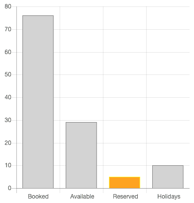
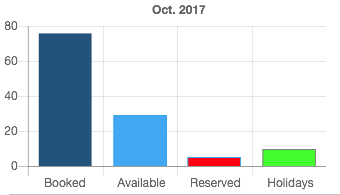
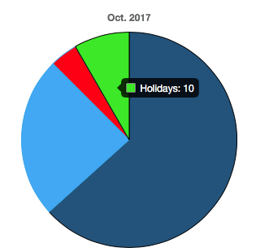

# Shortcode Charts Js Plugin

The **Shortcode Chart.js** Plugin is for [Grav CMS](http://github.com/getgrav/grav). It is a shortcode extension that add support for Chart.js to your Grav website.

## Installation

Installing the Shortcode Chart.js plugin can be done in one of three ways. The GPM (Grav Package Manager) installation method enables you to quickly and easily install the plugin with a simple terminal command, while the manual method enables you to do so via a zip file.

### Admin Manager/Plugins (Preferred)

The simplest way to install this plugin is via the [Grav Package Manager (GPM)](http://learn.getgrav.org/advanced/grav-gpm) through your system's terminal (also called the command line).  From the root of your Grav install type:

### GPM Installation (also good, more fiddly)

The simplest way to install this plugin is via the [Grav Package Manager (GPM)](http://learn.getgrav.org/advanced/grav-gpm) through your system's terminal (also called the command line).  From the root of your Grav install type:

    bin/gpm install shortcode-chartjs

This will install the Shortcode Charts Js plugin into your `/user/plugins` directory within Grav. Its files can be found under `/your/site/grav/user/plugins/shortcode-chartjs`.

### Manual Installation (if you're sure of what you're doing)

To install this plugin, just download the zip version of this repository and unzip it under `/your/site/grav/user/plugins`. Then, rename the folder to `shortcode-chartsjs`. You can find these files on [GitHub](https://github.com/craig-phillips/grav-plugin-shortcode-chartjs) or via [GetGrav.org](http://getgrav.org/downloads/plugins#extras).

You should now have all the plugin files under

    /your/site/grav/user/plugins/shortcode-chartsjs
	
> NOTE: This plugin is a modular component for Grav which requires [Grav](http://github.com/getgrav/grav) and the [Error](https://github.com/getgrav/grav-plugin-error) and [Problems](https://github.com/getgrav/grav-plugin-problems) to operate.

## Configuration
### via Admin
If you're using the Admin plugin simply navigate to Plugins and click on the ` Shortcode Chart.js` plugin.

The plugin comes with sensible default values, but you can change them as required using this screen. Once you've changed the options to suite you simply click on the `Save` button (top right).  Note you should save your settings at least once (even if you leave them on the default values).

### via GPM or Manually 

Before configuring this plugin, you should copy the `user/plugins/shortcode-charts-js/shortcode-chartjs.yaml` to `user/config/plugins/shortcode-chartjs.yaml` and only edit that copy.

Here is the default configuration and an explanation of available options:

```yaml
enabled: true
canvas:
  name: chart
  width: '400'
  height: '400'
chart:
  bkgndcolor: LightGray
  bordercolor: Gray
```

`enabled` — turns the Chart.js plugin on/off for the whole site. (**NB.** _the plugin will only be fired if you include the \[chartjs ...] shortcode in a page._)

`canvas` - Charts are drawn on the `canvas` HTML element. These are the default values for the minimum options.

> `name` - the HTML `id` of the `canvas`<br>(_If you use more than one chart on the same page you will need to override this in the shortcode of each chart._)  
> `width`  - the default width of the canvas, _you can override this per chart in the shortcode_.  
> `height` - the default height of the canvas, _you can override this per chart in the shortcode_.  

`chart`

> `bkgndcolor`  - The default fill color used for data points (e.g. the color of the column in a bar chart)
> `bordercolor` - The default border color used for data points (e.g. the border of a segment of a pie chart) 

## Usage

The shortcode is `[chartjs …]` - any chart you want to add to your page will start that way.

#### Example #1

The following shortcode:

```
[chartjs type="bar" datapoints="76,29,5,10" datalabels="Booked, Available, Reserved, Holidays"
 backgroundcolor3="orange" bordercolor3="yellow" responsive="false" legend="false" style="margin:25px;"][/chartjs]
```
results in this chart:



This first example is a simple bar chart (`type="bar"`) with four (4) data points `datapoints="76,29,5,10"` - notice that each value is separated by a comma.

We specify a set of labels one for each data point, also separated by commas — `datalabels="Booked, Available, Reserved, Holidays"`

Notice that we override the background and border colors for data point three (3) — `backgroundcolor3="orange" bordercolor3="yellow"`, all of the other data points get the default colors set in the plugins configuration. You can use any valid HTML color entries like `red` or `#ff0000` or `rgb(255,0,0)` or `rgba(255,0,0, 0.5)`

We set the `responsive` flag to `false` (it defaults to `true`) so that the size is fixed at the default settings in the plugin, otherwise it will resize to fit the width of the container element.

We turn off the charts legend `legend="false"`, as we haven't set a title and it's a simple chart.

Finally we add a basic HTML `style` attribute to give us some space around the chart.

#### Example #2

The following shortcode:
```
[chartjs name="bartest" width="350" height="200" type="bar" label="Oct. 2017" datapoints="76,29,5,10"
 datalabels="Booked, Available, Reserved, Holidays" backgroundcolor1="rgb(35, 82, 124)"
 backgroundcolor2="rgb(66, 165, 245)" backgroundcolor3="rgb(255, 5, 5)" backgroundcolor4="rgb(50, 255, 5)"
 bordercolor1="rgb(33, 80, 120);" bordercolor2="rgba(54, 162, 235, 1)" bordercolor3="rgba(54, 162, 235, 1)"
 legend="false" responsive="false" titledisplay="true" style="float:left"][/chartjs]
```
results in this chart:



In this example we've specifid the width and height `width="350" height="200"` rather than using the default values from the plugin.

We've also proved a `label="Oct. 2017"` value which shows above the chart in the `top` position.

#### Example #3

The following shortcode:
```
[chartjs name="piechart" width="300" height="300" type="pie" label="Oct. 2017" datapoints="76,29,5,10" 
 datalabels="Booked, Available, Reserved, Holidays" backgroundcolor1="rgb(35, 82, 124)" 
 backgroundcolor2="rgb(66, 165, 245)" backgroundcolor3="rgb(255, 5, 5)" backgroundcolor4="rgb(50, 255, 5)" 
 bordercolor1="rgb(33, 80, 120);" bordercolor2="rgba(54, 162, 235, 1)" bordercolor3="rgba(54, 162, 235, 1)" 
 legend="false" titledisplay="true" titleposition="bottom" responsive="false" style="clear:both;padding:15px 25%"]
[/chartjs] 
```
results in this chart:  


Here we've simple changed the type to `pie` and adjusted the `style` attributes to suit centered display in the enclosing block.

Finally we added `titleposition="bottom"` so that the chart title is now below the pie chart.

## Credits

This Grav Shortcode Plugin is only possible because of the awesome work of the [Chart.js](http://www.chartjs.org) project and it's [contributors](https://github.com/chartjs/Chart.js/contributors).

## To Do

 - [ ] More Chart.js options
 - [ ] Load data from file
 - [ ] Load data from URL 

